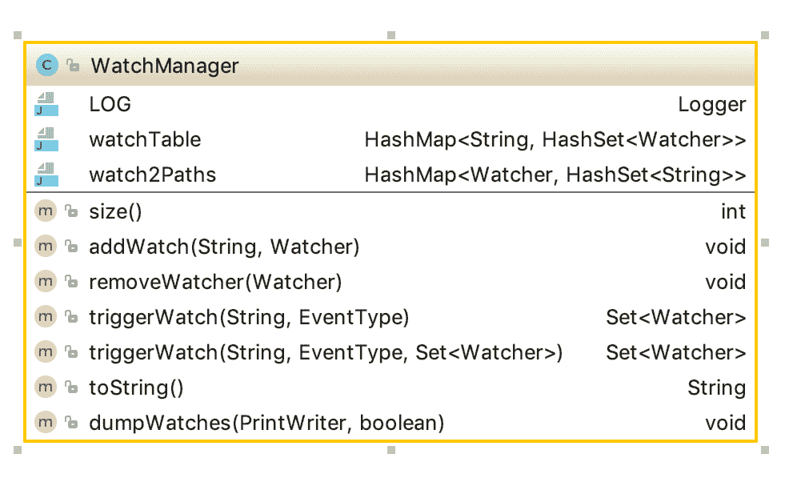

# Zookeeper 源码阅读（七） Server 端 Watcher

> 原文：[https://www.cnblogs.com/gongcomeon/p/9926632.html](https://www.cnblogs.com/gongcomeon/p/9926632.html)

### 前言

前面一篇主要介绍了 Watcher 接口相关的接口和实体类，但是主要是 zk 客户端相关的代码，如前一篇开头所说，client 需要把 watcher 注册到 server 端，这一篇分析下 server 端的 watcher。

主要分析 Watchmanager 类。

### Watchmanager



这是 WatchManager 的类图介绍。来看看代码：

```java
/**
 * This class manages watches. It allows watches to be associated with a string
 * and removes watchers and their watches in addition to managing triggers.
 */
//如注释所言，这个类主要负责管理 watcher
public class WatchManager {
    private static final Logger LOG = LoggerFactory.getLogger(WatchManager.class);

    //路径->watcher 的映射
    private final HashMap<String, HashSet<Watcher>> watchTable =
        new HashMap<String, HashSet<Watcher>>();

    //watcher->路径的映射
    private final HashMap<Watcher, HashSet<String>> watch2Paths =
        new HashMap<Watcher, HashSet<String>>(); 
```

#### size

```java
public synchronized int size(){
    int result = 0;
    for(Set<Watcher> watches : watchTable.values()) {//遍历路径->watcher 的映射
        result += watches.size();//把所有的 watch 个数加起来，但这里是不是会有重复？？？
    }
    return result;
} 
```

#### addWatch

```java
//为某个 path 注册 watcher
public synchronized void addWatch(String path, Watcher watcher) {
    HashSet<Watcher> list = watchTable.get(path);//获得路径对应的 watcher 的 set
    if (list == null) {//之前没有 watcher
        // don't waste memory if there are few watches on a node
        // rehash when the 4th entry is added, doubling size thereafter
        // seems like a good compromise
        list = new HashSet<Watcher>(4);//这里有优化，只建立为 4 的 set，可能是考虑到实际使用中同一个 znode 不会有过多的 watcher，节省了 memory
        watchTable.put(path, list);//更新 watchtable
    }
    list.add(watcher);//添加 watcher 进入 set

    HashSet<String> paths = watch2Paths.get(watcher);//在 watcher->路径中查找对应的路径
    if (paths == null) {
        // cnxns typically have many watches, so use default cap here
        paths = new HashSet<String>();//同理，同一个 watcher 可能被加到多个 znode 上
        watch2Paths.put(watcher, paths);
    }
    paths.add(path);//加入 set
} 
```

其实这个方法总的来说就是两大步，第一是更新路径->watcher 的映射，第二步是更新 watcher->路径的映射，很好理解。

#### removeWatcher

```java
//与上面方法相反，remove 对应的 watcher
public synchronized void removeWatcher(Watcher watcher) {
    HashSet<String> paths = watch2Paths.remove(watcher);//从 watcher->路径的映射中把整个 watcher 和它对应的所有 path 删掉
    if (paths == null) {//paths 是否为空
        return;
    }
    for (String p : paths) {//不为空的话就取出来一个一个在路径->watcher 的映射里扫描
        HashSet<Watcher> list = watchTable.get(p);//取出 watcher 的 set
        if (list != null) {
            list.remove(watcher);//remove 对应的 watcher
            if (list.size() == 0) {//如果之前只有一个 watcher，那么相应的 path 就没有 watcher 了，应该删掉
                watchTable.remove(p);
            }
        }
    }
} 
```

这里其实也是两大步，第一是更新 watcher->路径的映射，第二步更新路径->watcher 的映射，只是第二步的时候需要遍历所有 path。

#### triggerWatch

```java
//根据事件类型和路径触发 watcher，supress 是指定的应该被过滤的 watcher 集合
public Set<Watcher> triggerWatch(String path, EventType type, Set<Watcher> supress) {
    WatchedEvent e = new WatchedEvent(type,
            KeeperState.SyncConnected, path);//新建 watchedEvent 对象，这时一定是连接状态的
    HashSet<Watcher> watchers;
    synchronized (this) {
        watchers = watchTable.remove(path);//把对应路径所有的 watcher 删除并返回
        if (watchers == null || watchers.isEmpty()) {//watcher 为空直接打 log
            if (LOG.isTraceEnabled()) {
                ZooTrace.logTraceMessage(LOG,
                        ZooTrace.EVENT_DELIVERY_TRACE_MASK,
                        "No watchers for " + path);
            }
            return null;
        }
        for (Watcher w : watchers) {//watcher 不为空
            HashSet<String> paths = watch2Paths.get(w);
            if (paths != null) {
                paths.remove(path);//把所有的路径删掉
            }
        }
    }
    for (Watcher w : watchers) {//遍历前面获得的所有 watcher
        if (supress != null && supress.contains(w)) {//如果 watcher 在 supress 的 set 中跳过
            continue;
        }
        w.process(e);//不在 set 中就触发
    }
    return watchers;
} 
```

这里有两点需要特别说一下：

1.  为啥这里需要一个过滤的操作呢，可以通过下面 datatree 中 deletenode 里的代码可以了解：

    ```java
    Set<Watcher> processed = dataWatches.triggerWatch(path,
            EventType.NodeDeleted);//1
    childWatches.triggerWatch(path, EventType.NodeDeleted, processed);//2
    childWatches.triggerWatch(parentName.equals("") ? "/" : parentName,
            EventType.NodeChildrenChanged); 
    ```

可以看到，每个节点对应的 watch 会存到 datawatches 里，且如果一个节点是另一个节点的子节点，那么在 server 获取 getchildren 指令的时候会把 children 相关的的 watch 加入到 datatree 的 childwatches 里去。这时如果节点本身已经触发过了那么 childwatches 里的节点的 watches 便不用被触发了（因为节点都要被 delete 了，不存在子节点）。

1.  最后的 process 方法并不是客户端的 watcher，而是 ServerCnxn 的 process，默认实现是 NIOServerCnxn。

```java
@Override
synchronized public void process(WatchedEvent event) {
    ReplyHeader h = new ReplyHeader(-1, -1L, 0);
    if (LOG.isTraceEnabled()) {
        ZooTrace.logTraceMessage(LOG, ZooTrace.EVENT_DELIVERY_TRACE_MASK,
                                 "Deliver event " + event + " to 0x"
                                 + Long.toHexString(this.sessionId)
                                 + " through " + this);
    }

    // Convert WatchedEvent to a type that can be sent over the wire
    WatcherEvent e = event.getWrapper();//包装 watcherevent

    sendResponse(h, e, "notification");//发送回复
} 
```

#### DumpWatches

```java
/**
 * String representation of watches. Warning, may be large!
 * @param byPath iff true output watches by paths, otw output
 * watches by connection
 * @return string representation of watches
 */
//把 watch 写到磁盘中
public synchronized void dumpWatches(PrintWriter pwriter, boolean byPath) {
    if (byPath) {
        for (Entry<String, HashSet<Watcher>> e : watchTable.entrySet()) {
            pwriter.println(e.getKey());//利用 PrintWriter 去写
            for (Watcher w : e.getValue()) {
                pwriter.print("\t0x");
                pwriter.print(Long.toHexString(((ServerCnxn)w).getSessionId()));
                pwriter.print("\n");
            }
        }
    } else {
        for (Entry<Watcher, HashSet<String>> e : watch2Paths.entrySet()) {
            pwriter.print("0x");
            pwriter.println(Long.toHexString(((ServerCnxn)e.getKey()).getSessionId()));
            for (String path : e.getValue()) {
                pwriter.print("\t");
                pwriter.println(path);
            }
        }
    }
} 
```

### 总结

1.  zk 的 cnxn 的实现由 NIO 和 Netty 两种方式，最近工作也用了些 Netty 相关的，抽空好好学习总结下。

### 参考

[https://www.cnblogs.com/leesf456/p/6288709.html](https://www.cnblogs.com/leesf456/p/6288709.html)

[https://www.jianshu.com/p/9cf98fab15ac](https://www.jianshu.com/p/9cf98fab15ac)